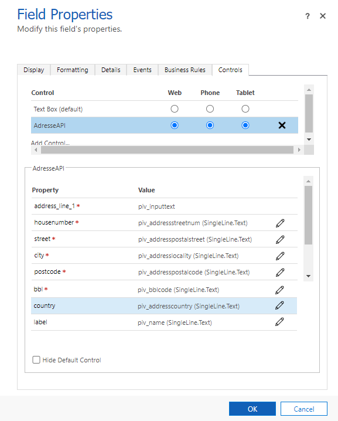
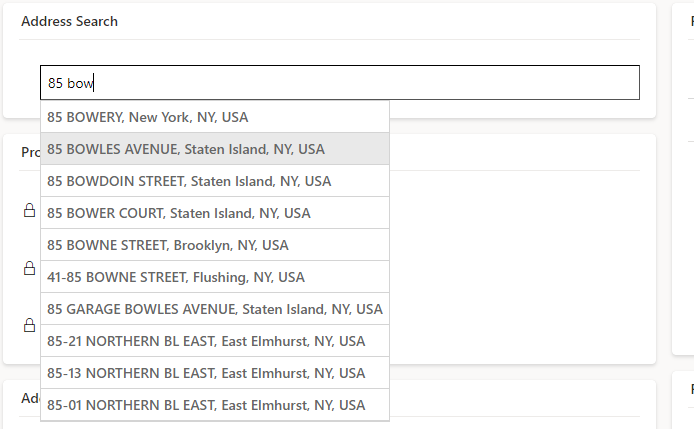

# AdresseAPI
 
Custom Control for the NYC GeoSearch address API https://geosearch.planninglabs.nyc/.

Control is applied on a Singleline text and acts as an autocomplete control. It displays results from NYC GeoSearch address. When an address is selected, following attributes can be mapped to table columns :
Street Line (ex : BOWERY)
Street Number (ex: 85)
City, (ex: New York)
Postal Code, (ex: 10002)
Country, (ex: United States)
Full Address Label, (ex: 85 BOWERY, New York, NY, USA)
BBL code (Borough 1-digit, Block 5-digit, Lot 4-digit) (ex : 1003030011)

Installation step by step : 

1 - Import the managed solution on your CRM  
2 - Open the form on which you want add the PCF  
3 - Select the field corresponding to the street of the address to configure the PCF  
4 - On the tab "Control" add the PCF and select in which case you want display it  
5 - Below you need to select fields corresponding to the street, postal code, city, etc.  
6 - Publish  
 

# Demo 

